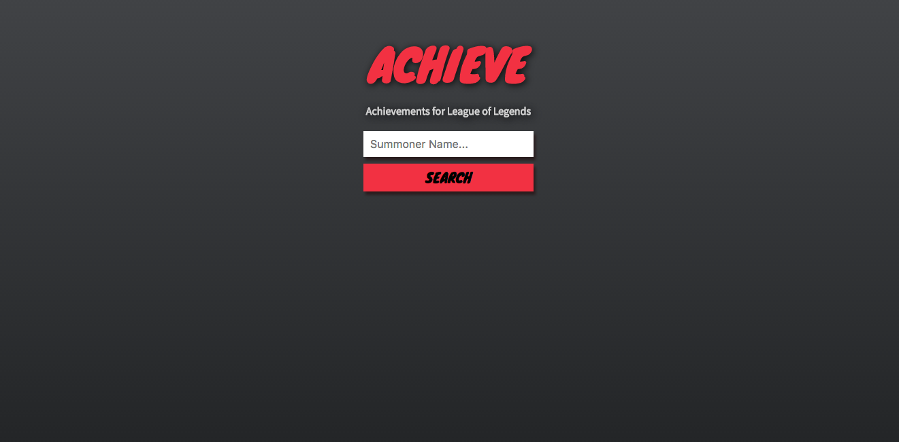

# Achieve
Personal project to showcase my skills as a Full Stack developer

>Achieve is a web app built using the Riot Games Developer API that allows you to track achievements for your League of Legends account. It is light-weight, minimalistic, and mobile friendly providing you unique information about summoners.

### Roadblocks
- [x] multiple parallel http requests
- [x] mustache partials

### Stretch Goals
- [ ] mobile friendly
- [ ] deployed live
- [ ] account tracking with hosted data base
- [ ] leader boards for account achievement score
- [ ] live game lookup

### Design sketches
<!--   -->

### More Screenshots
