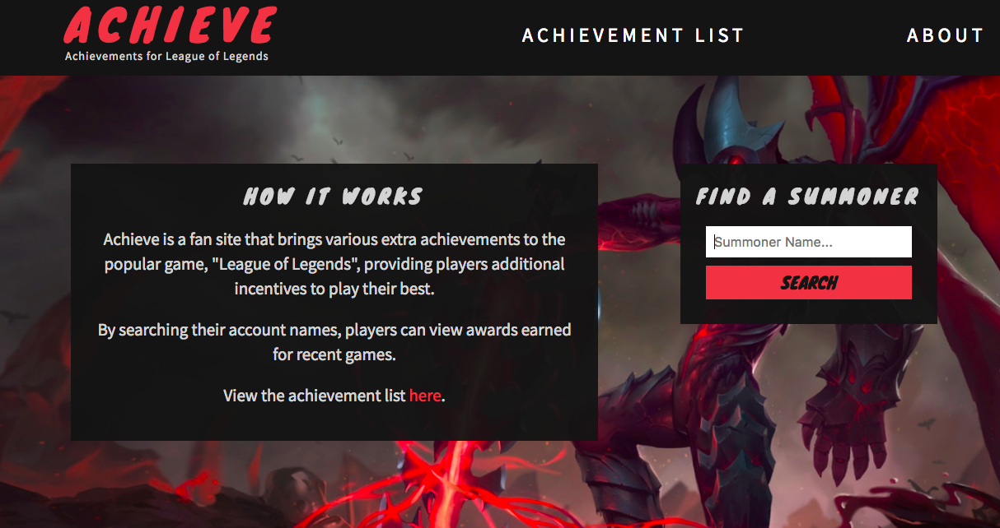
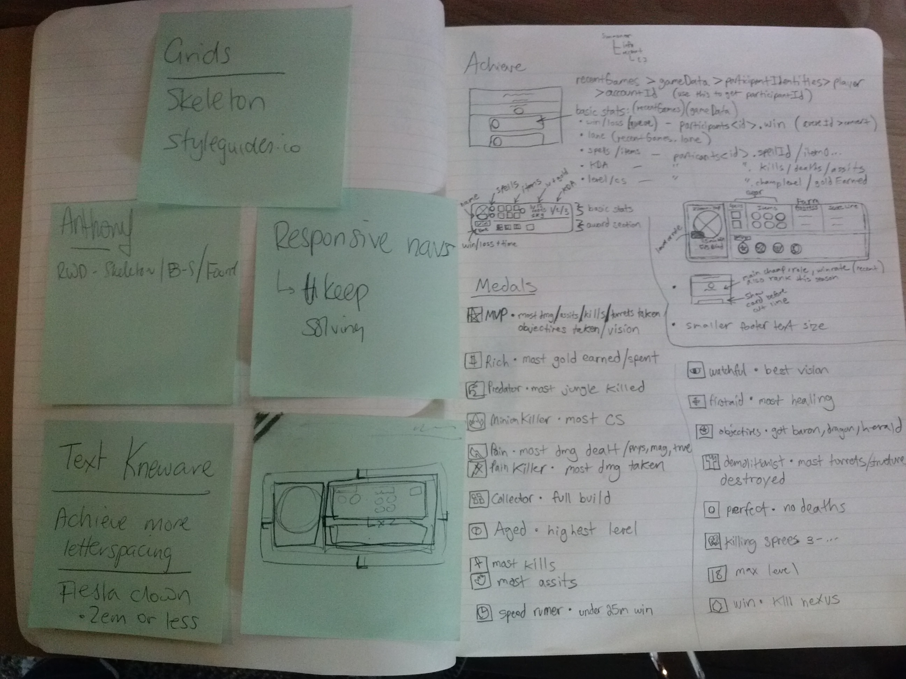
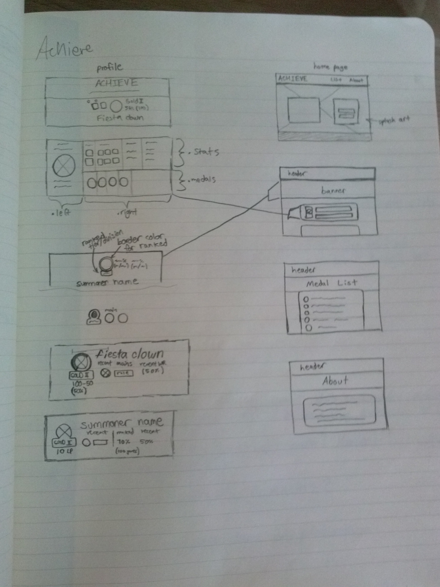
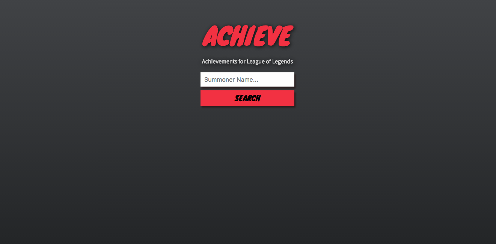
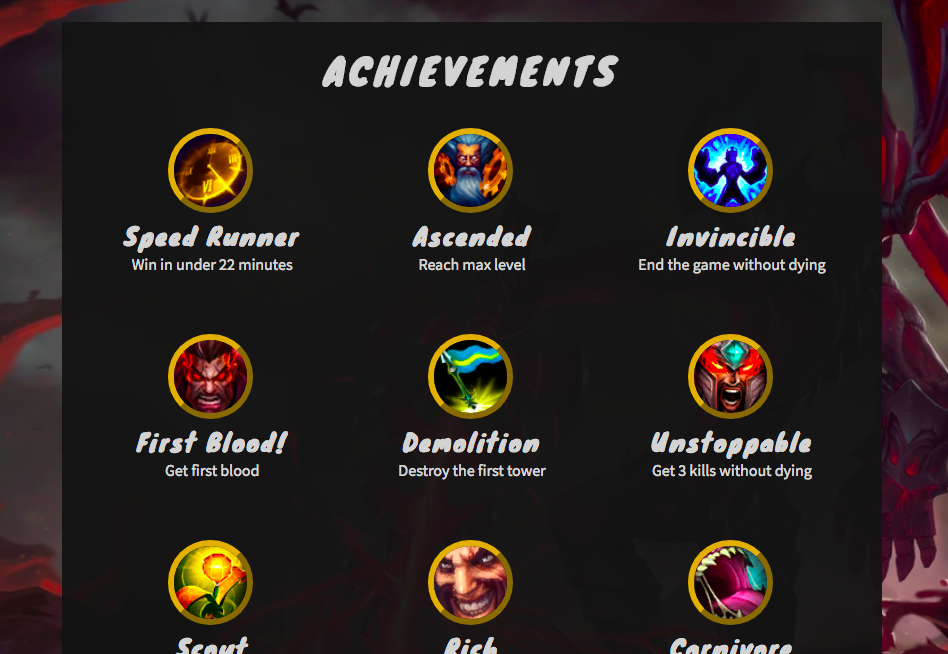
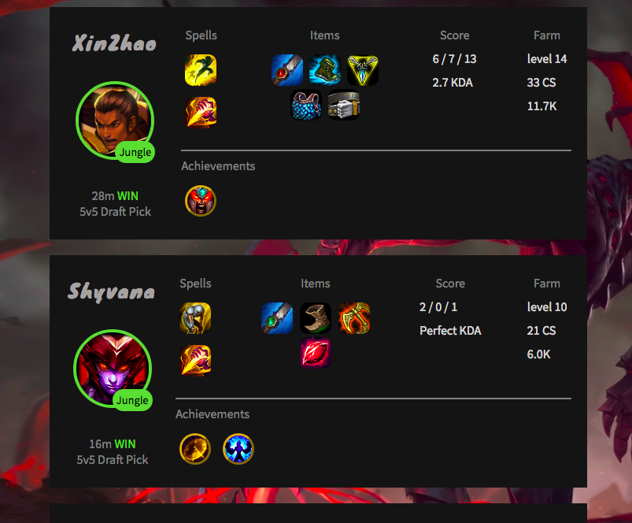

# Achieve
Capstone project created to demonstrate both frontend and backend web development skills learned while attending The Iron Yard coding bootcamp.

>Achieve is a fan site that brings various extra achievements to the popular game, "League of Legends", providing players additional incentives to play well.

>By searching their account names, players can view awards earned for recent games.

### About
Achieve is built using the Riot Games Developer API and runs in a Node environment. It uses Express server to serve files, node-fetch for HTTP requests, and Mustache template engine for rendering pages to the client.

### Roadblocks
- api key rate limiting
- multiple parallel http requests
- large data sets

### Stretch Goals
- [ ] mobile friendly
- [ ] deployed live
- [ ] account tracking with hosted data base
- [ ] leader boards for account achievement score
- [ ] live game lookup

### Design sketches

### Old Screenshot

### Finished Product Screenshots

